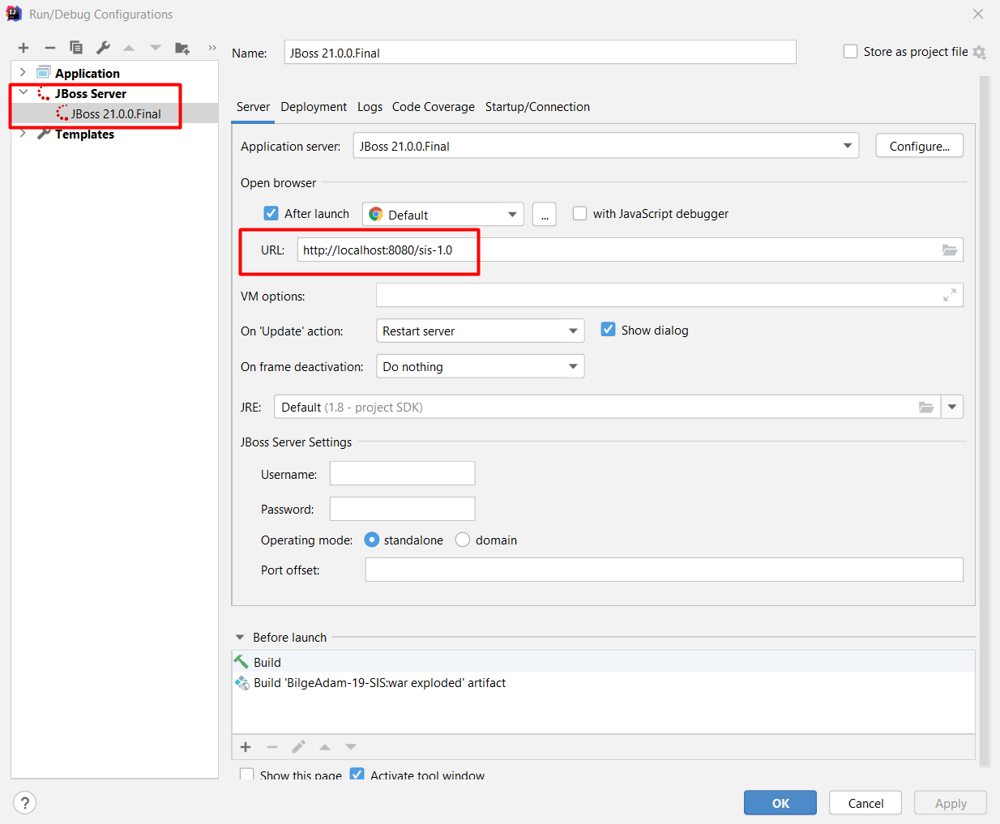
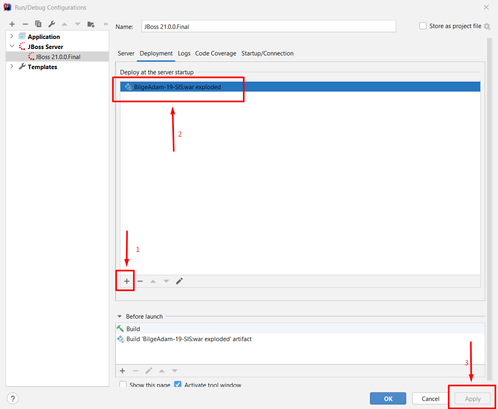
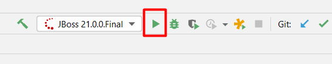

Student Information System Application for BilgeAdam JSF Course
-----------------------------
This is an example demo project for JSF introduction.

How to configure the project:
-----------------------

It is necessary to configure project for your local machine. To do this;
* Configure `mysql-ds.xml` to point your local database; _(change `sisdb` with your database schema name)_
```
<datasources>
    <datasource jndi-name="java:jboss/datasources/sisDS"
                pool-name="jsfPool">
        <connection-url>jdbc:mysql://localhost/sisdb?characterEncoding=UTF8
        </connection-url>
        <driver>mysql</driver>
        <pool>
            <min-pool-size>1</min-pool-size>
            <max-pool-size>5</max-pool-size>
            <prefill>true</prefill>
        </pool>
        <security>
            <user-name>root</user-name>
            <password>password</password>
        </security>
    </datasource>
</datasources>
```
* Edit run configurations from **Run --> Edit Configurations** like below image;
  
  


How to run the project:
-----------------------
* It is ready to run project on Wildfly Server;
  
  

* You can reach the index page by typing;
```
http://localhost:8080/sis-1.0
```
