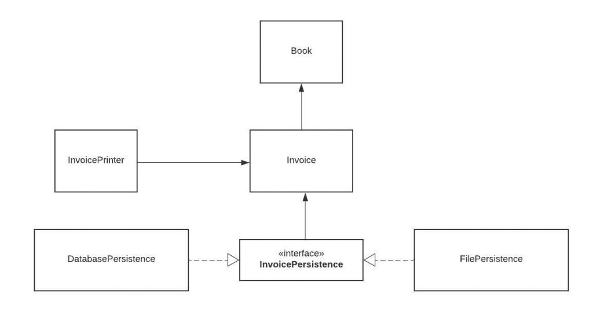

# Open-Closed Principle
The Open-Closed Principle requires that classes should be open for extension and closed to modification.

Modification means changing the code of an existing class, and extension means adding new functionality.

So what this principle wants to say is: We should be able to add new functionality without touching the existing code for the class. This is because whenever we modify the existing code, we are taking the risk of creating potential bugs. So we should avoid touching the tested and reliable (mostly) production code if possible.

But how are we going to add new functionality without touching the class, you may ask. It is usually done with the help of interfaces and abstract classes.

Now that we have covered the basics of the principle, let's apply it to our Invoice application.

Let's say our boss came to us and said that they want invoices to be saved to a database so that we can search them easily. We think okay, this is easy peasy boss, just give me a second!

We create the database, connect to it, and we add a save method to our InvoicePersistence class:

    public class InvoicePersistence {
        Invoice invoice;
    
        public InvoicePersistence(Invoice invoice) {
            this.invoice = invoice;
        }
    
        public void saveToFile(String filename) {
            // Creates a file with given name and writes the invoice
        }
    
        public void saveToDatabase() {
            // Saves the invoice to database
        }
    }
Unfortunately we, as the lazy developer for the book store, did not design the classes to be easily extendable in the future. So in order to add this feature, we have modified the InvoicePersistence class.

If our class design obeyed the Open-Closed principle we would not need to change this class.

So, as the lazy but clever developer for the book store, we see the design problem and decide to refactor the code to obey the principle.

    interface InvoicePersistence {
        public void save(Invoice invoice);
    }
We change the type of InvoicePersistence to Interface and add a save method. Each persistence class will implement this save method.

    public class DatabasePersistence implements InvoicePersistence {
    
        @Override
        public void save(Invoice invoice) {
            // Save to DB
        }
    }

    public class FilePersistence implements InvoicePersistence {
    
        @Override
        public void save(Invoice invoice) {
            // Save to file
        }
    }
So our class structure now looks like this:

Now our persistence logic is easily extendable. If our boss asks us to add another database and have 2 different types of databases like MySQL and MongoDB, we can easily do that.

You may think that we could just create multiple classes without an interface and add a save method to all of them.

But let's say that we extend our app and have multiple persistence classes like InvoicePersistence, BookPersistence and we create a PersistenceManager class that manages all persistence classes:
    
    public class PersistenceManager {
        InvoicePersistence invoicePersistence;
        BookPersistence bookPersistence;
    
        public PersistenceManager(InvoicePersistence invoicePersistence,
                                  BookPersistence bookPersistence) {
            this.invoicePersistence = invoicePersistence;
            this.bookPersistence = bookPersistence;
        }
    }
We can now pass any class that implements the InvoicePersistence interface to this class with the help of polymorphism. This is the flexibility that interfaces provide.