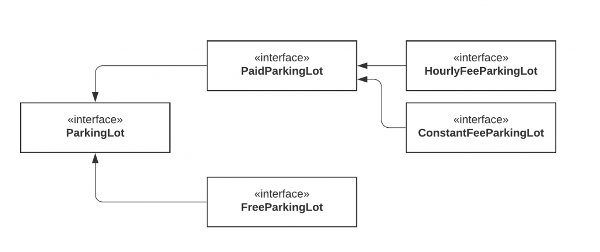

# Interface Segregation Principle
Segregation means keeping things separated, and the Interface Segregation Principle is about separating the interfaces.

The principle states that many client-specific interfaces are better than one general-purpose interface. Clients should not be forced to implement a function they do no need.

This is a simple principle to understand and apply, so let's see an example.

    public interface ParkingLot {
    
        void parkCar();	// Decrease empty spot count by 1
        void unparkCar(); // Increase empty spots by 1
        void getCapacity();	// Returns car capacity
        double calculateFee(Car car); // Returns the price based on number of hours
        void doPayment(Car car);
    }
    
    class Car {
    
    }
We modeled a very simplified parking lot. It is the type of parking lot where you pay an hourly fee. Now consider that we want to implement a parking lot that is free.

    public class FreeParking implements ParkingLot {
    
        @Override
        public void parkCar() {
            
        }
    
        @Override
        public void unparkCar() {
    
        }
    
        @Override
        public void getCapacity() {
    
        }
    
        @Override
        public double calculateFee(Car car) {
            return 0;
        }
    
        @Override
        public void doPayment(Car car) {
            throw new Exception("Parking lot is free");
        }
    }
Our parking lot interface was composed of 2 things: Parking related logic (park car, unpark car, get capacity) and payment related logic.

But it is too specific. Because of that, our FreeParking class was forced to implement payment-related methods that are irrelevant. Let's separate or segregate the interfaces.

We've now separated the parking lot. With this new model, we can even go further and split the PaidParkingLot to support different types of payment.

Now our model is much more flexible, extendable, and the clients do not need to implement any irrelevant logic because we provide only parking-related functionality in the parking lot interface.